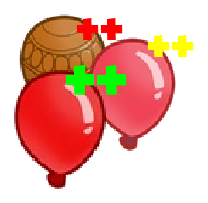

<h1 align="center">BloonProgression</h1>

This mod Adds Three new Game Modes. Bloon Progression Easy, Bloon Progression Medium, and Bloon Progression Hard. 

The Bloon Progression is: Red - Blue - Green - Yellow - Pink - Black + White - Purple - Zebra - Lead (Only in Medium +  Hard) - Rainbow - Ceramic - Moab - Bfb - Fortified Moab - Zomg - Fortified Bfb - Ddt - Fortified Zomg - Fortified Ddt - Bad - Fortified Bad. 

Easy Ends at Round 10, Medium Ends at Round 15 and Hard Ends at round 21

<h2 align="center"Join The Discord!</h2>
    

